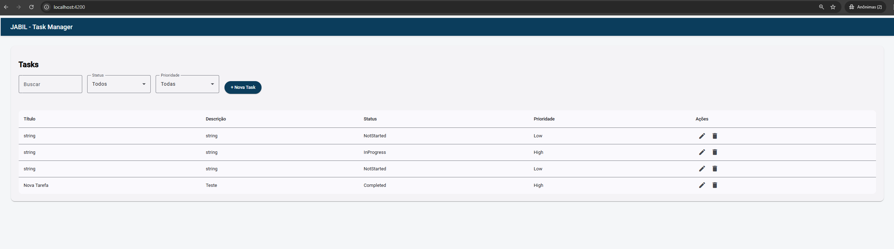
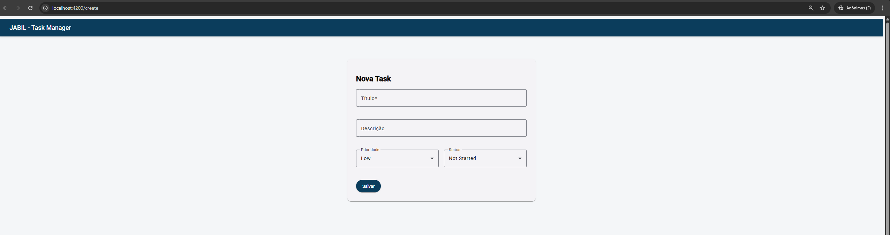
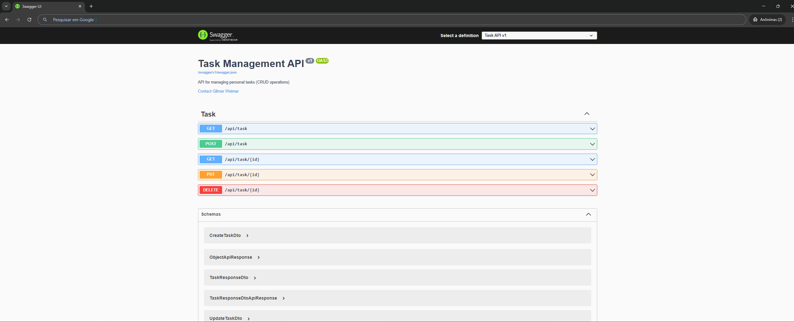
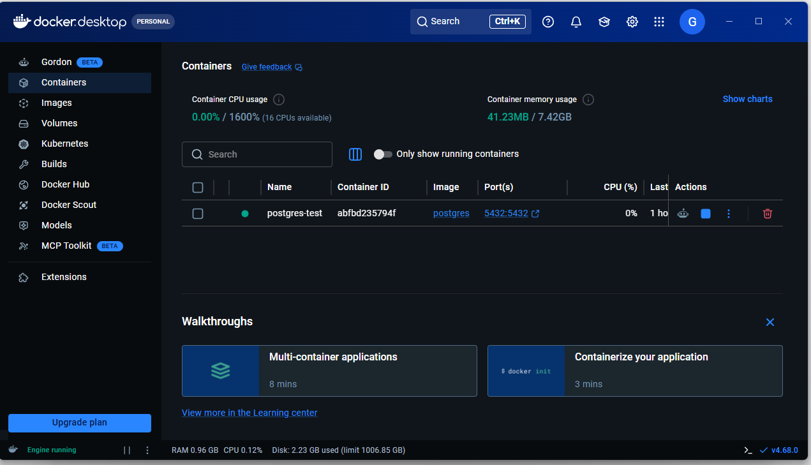
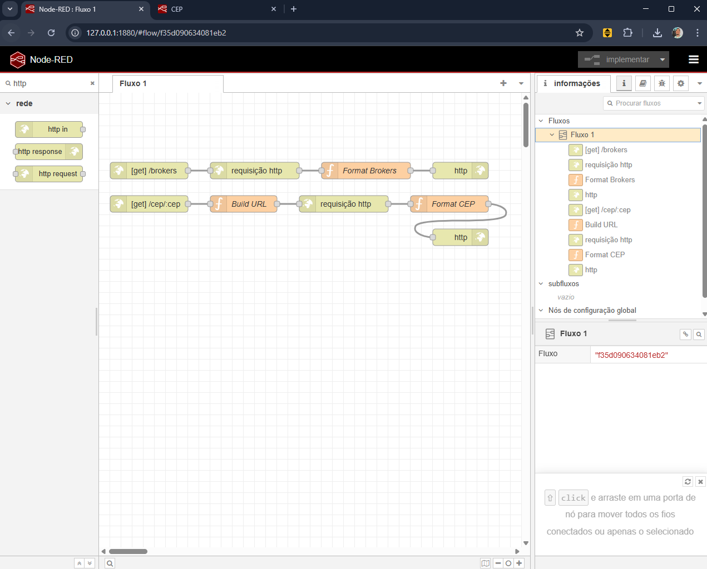
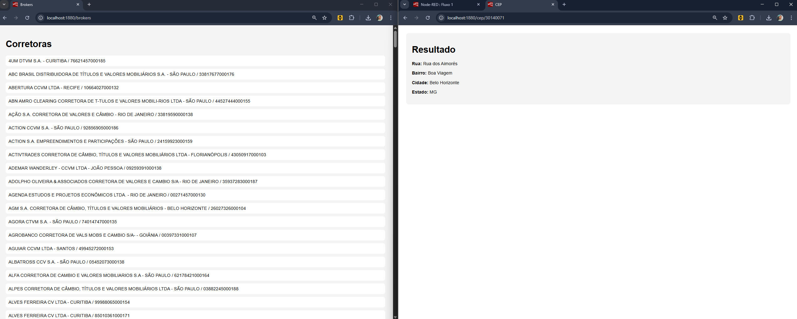

# 🚀 Jabil - Technical Test (Junior Developer)

## 📌 Overview

This project was developed as part of the technical assessment for the Junior Developer position at Jabil.

The objective is to demonstrate full stack development skills, REST API design, and integration with external services using Node-RED.

The solution is divided into two independent parts:

* Task Management System (Full Stack)
* Node-RED Integration (External APIs)

---

## 🏗️ Project Structure

```
JABIL-TESTE
├── frontend     # Angular application
├── backend      # ASP.NET Core API
├── nodered      # Node-RED integration
│   ├── flow.json
└── README.md
```

---

## ⚙️ Technologies Used

### Front-end

* Angular
* Angular Material
* TypeScript

### Back-end

* ASP.NET Core 6+
* Entity Framework Core

### Database

* PostgreSQL (Docker)

### Integration

* Node.js
* Node-RED
* BrasilAPI

---

## 🚀 How to Run the Project

### 🔹 1. Clone repository

```
git clone <your-repo-url>
cd JABIL-TESTE
```

---

## 🐳 2. Run PostgreSQL with Docker

```bash
docker run -d --name postgres-task \
-e POSTGRES_DB=tasksdb \
-e POSTGRES_USER=postgres \
-e POSTGRES_PASSWORD=postgres \
-p 5432:5432 postgres:15
```

### ✔ Verify container is running

You should see it in Docker Desktop:

* Container name: `postgres-task`
* Port: `5432`

---

## ⚙️ 3. Configure Backend

File:

```
backend/appsettings.json
```

```
"ConnectionStrings": {
  "DefaultConnection": "Host=localhost;Port=5432;Database=tasksdb;Username=postgres;Password=postgres"
}
```

---

## ▶️ 4. Run Backend

```
cd backend
dotnet restore
dotnet ef database update
dotnet run
```

### API:

```
http://localhost:5000
```

### Swagger:

```
http://localhost:5000/swagger
```

---

## 🌐 5. Run Frontend

```
cd frontend
npm install
npm start
```

### App:

```
http://localhost:4200
```

---

## 🔗 6. Run Node-RED

```
cd nodered
npm install
npx node-red
```

### Node-RED UI:

```
http://localhost:1880
```

---

## 📊 Node-RED Routes

### Broker Catalog

```
http://localhost:1880/brokers
```

Displays:

* Name
* City
* CNPJ

---

### ZIP Code Search

```
http://localhost:1880/cep/{zipcode}
```

Example:

```
http://localhost:1880/cep/30140071
```

Returns:

* Street
* Neighborhood
* City
* State

---

## 🔄 Node-RED Flow

```
HTTP In → HTTP Request → Function → HTTP Response
```

---

## 📦 Flow Export

```
/nodered/flow.json
```

---

## 🧠 Design Decisions

* Separation between backend and integration layer
* Node-RED used only for external API consumption
* Clean architecture and readability
* Focus on simplicity and maintainability

---

## 🚧 Improvements

* Authentication (JWT)
* Unit tests
* Better UI/UX
* Error handling improvements

---

## 👨‍💻 Author

Gilmar Weimar


## 📸 Screenshots

### 🖥️ Frontend - Lista de Tasks


### 📝 Frontend - Cadastro/Edição


### 🔗 Backend - Swagger API


### 🗄️ Banco de Dados


### 🔄 Node-RED - Fluxo


### 📊 Node-RED - Resultado

